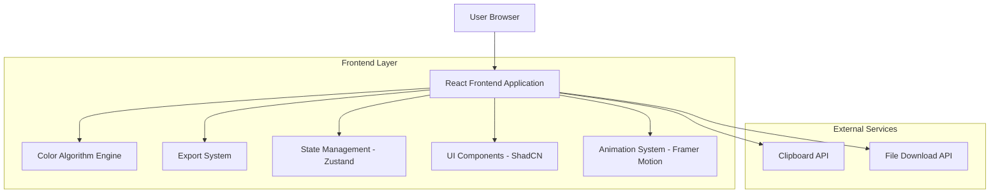

# Pigmenta - Technical Architecture Document

## 1. Architecture Design



## 2. Technology Description

* Frontend: React\@18 + TypeScript\@5 + Vite\@5

* Styling: TailwindCSS\@3 + CSS Custom Properties

* UI Components: ShadCN UI + Lucide React Icons

* Animations: Framer Motion\@11

* State Management: Zustand\@4

* Color Processing: chroma-js\@2 + culori\@3

* Build Tool: Vite with TypeScript

* Code Quality: ESLint + Prettier + Husky

## 3. Route Definitions

| Route | Purpose                                            |
| ----- | -------------------------------------------------- |
| /     | Página principal del generador de colores Pigmenta |

## 4. API Definitions

No se requieren APIs backend - toda la funcionalidad es client-side.

### 4.1 Core Interfaces

```typescript
// Color Types
interface ColorValue {
  hex: string;
  rgb: { r: number; g: number; b: number };
  hsl: { h: number; s: number; l: number };
  oklch: { l: number; c: number; h: number };
}

interface ColorShade {
  name: string;
  value: number;
  color: ColorValue;
  isActive?: boolean;
}

interface ColorPalette {
  name: string;
  baseColor: ColorValue;
  shades: ColorShade[];
  algorithm: ColorAlgorithm;
}

// Control Types
type ColorAlgorithm = 'tailwind' | 'material' | 'custom';
type ColorFormat = 'rgb' | 'hsl' | 'oklch';
type NamingPattern = '50-950' | '100-900' | 'custom';
type ExportFormat = 'css' | 'tailwind' | 'tailwind4' | 'tokens' | 'svg';

interface AppState {
  // Color State
  baseColor: ColorValue;
  palette: ColorPalette;
  activeShade: number;
  
  // Control State
  algorithm: ColorAlgorithm;
  contrastShift: number;
  namingPattern: NamingPattern;
  shadeCount: number;
  colorFormat: ColorFormat;
  
  // UI State
  controlsExpanded: boolean;
  exportFormat: ExportFormat;
  colorName: string;
}

// Component Props
interface ColorPickerProps {
  value: ColorValue;
  onChange: (color: ColorValue) => void;
  format: ColorFormat;
}

interface PaletteGridProps {
  palette: ColorPalette;
  activeShade: number;
  onShadeSelect: (shade: number) => void;
}

interface ExportPanelProps {
  palette: ColorPalette;
  format: ExportFormat;
  colorName: string;
  onFormatChange: (format: ExportFormat) => void;
  onNameChange: (name: string) => void;
}
```

## 5. Server Architecture Diagram

No se requiere arquitectura de servidor - aplicación completamente client-side.

## 6. Data Model

### 6.1 Data Model Definition

No se requiere base de datos - todo el estado se maneja en memoria del cliente.

### 6.2 Local Storage Schema

```typescript
// Local Storage para persistencia opcional
interface StoredPreferences {
  lastUsedAlgorithm: ColorAlgorithm;
  defaultShadeCount: number;
  preferredFormat: ColorFormat;
  recentColors: ColorValue[];
}
```

## 7. Component Architecture

### 7.1 Component Hierarchy

```
App
├── Header
│   ├── Logo
│   └── Navigation
├── MainContent
│   ├── ColorInputSection
│   │   ├── ColorPicker
│   │   ├── HexInput
│   │   ├── FormatSelector
│   │   └── RGBSliders
│   ├── ControlsPanel
│   │   ├── AlgorithmSelector
│   │   ├── ContrastSlider
│   │   ├── NamingPatternSelector
│   │   └── ShadeCountControl
│   ├── PaletteDisplay
│   │   └── ColorCell[]
│   └── ExportSection
│       ├── ColorNameInput
│       ├── ExportButtons
│       ├── FormatTabs
│       └── CodeDisplay
└── Footer (opcional)
```

### 7.2 Key Algorithms

```typescript
// Color Generation Algorithms
class TailwindColorGenerator {
  static generateShades(baseColor: ColorValue, count: number): ColorShade[] {
    // Implementación del algoritmo Tailwind CSS
    // Genera tonalidades 50, 100, 200, 300, 400, 500, 600, 700, 800, 900, 950
  }
}

class ColorConverter {
  static hexToRgb(hex: string): RGB;
  static rgbToHsl(rgb: RGB): HSL;
  static hslToOklch(hsl: HSL): OKLCH;
  static getContrastRatio(color1: ColorValue, color2: ColorValue): number;
}

class ExportGenerator {
  static generateCSS(palette: ColorPalette): string;
  static generateTailwind(palette: ColorPalette): string;
  static generateSVG(palette: ColorPalette): string;
  static generateTokens(palette: ColorPalette): object;
}
```

### 7.3 State Management Structure

```typescript
// Zustand Store
interface ColorStore {
  // State
  state: AppState;
  
  // Actions
  setBaseColor: (color: ColorValue) => void;
  updateAlgorithm: (algorithm: ColorAlgorithm) => void;
  adjustContrastShift: (shift: number) => void;
  setShadeCount: (count: number) => void;
  selectShade: (shade: number) => void;
  toggleControls: () => void;
  updateColorName: (name: string) => void;
  setExportFormat: (format: ExportFormat) => void;
  
  // Computed
  generatePalette: () => ColorPalette;
  exportCode: () => string;
}
```

### 7.4 Performance Optimizations

* **Memoización**: React.memo para componentes de color

* **useMemo**: Para cálculos de paleta costosos

* **useCallback**: Para handlers de eventos

* **Debouncing**: En inputs de color y sliders

* **Virtual Scrolling**: Para listas grandes de colores

* **Code Splitting**: Lazy loading de algoritmos de color

### 7.5 Styling Architecture

```css
/* CSS Custom Properties (Variables) */
:root {
  /* Colors */
  --color-background: #ececec;
  --color-foreground: #161718;
  --color-background-secondary: #fafafa;
  --color-white: #fff;
  
  /* Shadows */
  --shadow-sm: 0 1px 2px rgba(0,0,0,0.04);
  --shadow-lg: 0 4px 6px rgba(0,0,0,0.07), 0 10px 15px rgba(0,0,0,0.1);
  
  /* Radii */
  --radii-sm: 4px;
  --radii-md: 8px;
  --radii-lg: 12px;
  --radii-xl: 16px;
  --radii-2xl: 18px;
  --radii-full: 9999px;
  
  /* Typography */
  --font-inter: 'Inter Display', -apple-system, BlinkMacSystemFont, sans-serif;
  --font-mono: 'JetBrains Mono', 'Fira Code', monospace;
}

/* Component-specific styles */
.color-cell {
  @apply rounded-lg shadow-lg transition-all duration-200;
  @apply hover:scale-105 hover:shadow-xl;
}

.control-slider {
  @apply appearance-none bg-gradient-to-r;
  @apply focus:outline-none focus:ring-2 focus:ring-blue-500;
}
```

