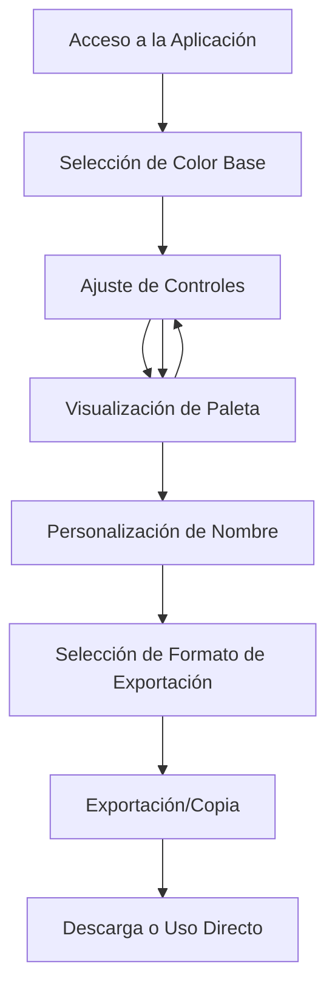

# Pigmenta - Product Requirements Document

## 1. Product Overview

Pigmenta es una aplicación web avanzada para generar paletas de colores profesionales para sistemas de diseño, clonada exactamente de Kigen Color Generator. La herramienta permite a diseñadores y desarrolladores crear, personalizar y exportar paletas de colores completas con múltiples tonalidades basadas en algoritmos de color establecidos como Tailwind CSS.

La aplicación resuelve el problema de crear paletas de colores consistentes y accesibles para proyectos de diseño, eliminando el trabajo manual y proporcionando exportación directa en múltiples formatos para integración inmediata en proyectos.

## 2. Core Features

### 2.1 User Roles

No se requiere distinción de roles - la aplicación es de acceso libre sin registro.

### 2.2 Feature Module

Nuestra aplicación Pigmenta consiste en las siguientes páginas principales:

1. **Página Principal**: Header de navegación con logo Pigmenta, selector de color principal, controles de generación, visualización de paleta, panel de exportación.

### 2.3 Page Details

| Page Name | Module Name | Feature description |
|-----------|-------------|---------------------|
| Página Principal | Header Navigation | Logo Pigmenta + '/Color Generator', enlaces a Figma Plugin, About, Share con estilos específicos |
| Página Principal | Color Input Section | Color picker circular, input hexadecimal, selector de formato (RGB/HSL/OKLCH), sliders RGB con gradientes dinámicos |
| Página Principal | Controls Panel | Selector de algoritmo (Tailwind CSS), slider de contrast shift, selector de naming pattern, contador de shades con botones +/- |
| Página Principal | Palette Display | Grid de 11 colores (50-950), cada celda con nombre y valor hex, indicador de color activo, animaciones hover |
| Página Principal | Export Section | Input de nombre de color, botones de exportación SVG/Figma y SVG, tabs de formato (CSS, Tailwind, etc.), múltiples formatos de salida |

## 3. Core Process

Flujo principal del usuario:
1. El usuario accede a la aplicación
2. Selecciona un color base usando el color picker o input hexadecimal
3. Ajusta los controles (algoritmo, contraste, naming pattern, cantidad de shades)
4. Visualiza la paleta generada automáticamente
5. Personaliza el nombre del color
6. Exporta la paleta en el formato deseado (CSS, Tailwind, SVG, etc.)
7. Copia los valores al portapapeles o descarga archivos

## 4. User Interface Design

### 4.1 Design Style

**Colores Principales:**
- Fondo: #ececec (gris claro)
- Foreground: #161718 (texto principal)
- Background secundario: #fafafa
- Blanco: #fff
- Sombras: Múltiples capas con rgba(0,0,0,0.04-0.26)

**Estilo de Botones:**
- Bordes redondeados variables (4px, 8px, 12px, 16px, 18px, full)
- Sombras complejas con múltiples capas (--shadow-lg)
- Estados hover con animaciones suaves
- Botones con gradientes y efectos de borde animados

**Tipografía:**
- Fuente principal: Inter Display
- Font-feature-settings: "ss01" on, "cv11" on, "cv12" on, "cv13" on, "cv06" on, "cv05" on
- Tamaños: 14px (labels), 16px (texto), 18px (párrafos)
- Pesos: 300, 400, 500, 600, 700

**Layout:**
- Diseño centrado con contenedor máximo de 1100px
- Espaciado generoso con padding de 1rem
- Grid system para la paleta de colores
- Componentes con sombras y bordes sutiles

**Iconos y Animaciones:**
- Iconos SVG con currentColor
- Animaciones de hover suaves (0.2s ease)
- Transiciones en cambios de estado
- Efectos de glow y sombras animadas

### 4.2 Page Design Overview

| Page Name | Module Name | UI Elements |
|-----------|-------------|-------------|
| Página Principal | Header | Fondo blanco, logo con imagen + texto, navegación horizontal, enlaces con hover states |
| Página Principal | Color Input | Color picker circular con borde, input hex con estilos custom, selector dropdown con chevron, sliders con gradientes RGB |
| Página Principal | Controls | Labels con tipografía específica, dropdowns con animaciones, slider con thumb personalizado, botones +/- con sombras |
| Página Principal | Palette Grid | Celdas cuadradas con bordes redondeados, sombras var(--shadow-lg), texto con contraste automático, animaciones de hover |
| Página Principal | Export Panel | Input con estilos custom, botones con gradientes y sombras, tabs con estados activos, código con syntax highlighting |

### 4.3 Responsiveness

La aplicación es desktop-first con adaptación móvil:
- Breakpoints: 768px (tablet), 700px (móvil)
- Grid de paleta se adapta a columnas menores en móvil
- Controles se reorganizan verticalmente
- Texto y espaciado se ajustan proporcionalmente
- Touch-friendly en dispositivos móviles