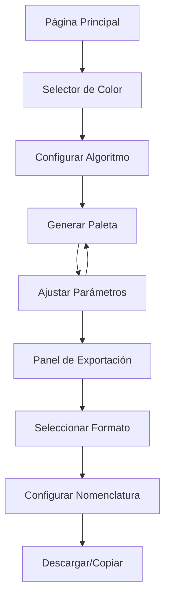

# Pigmenta - Generador de Paletas de Colores

## 1. Product Overview

Pigmenta es un generador avanzado de paletas de colores que permite crear sistemas de diseño completos a partir de un color base. La aplicación genera automáticamente escalas de colores armoniosas utilizando algoritmos de color profesionales, facilitando la creación de paletas consistentes para proyectos de diseño y desarrollo web.

Pigmenta resuelve el problema de crear paletas de colores coherentes y accesibles, dirigido a diseñadores, desarrolladores frontend y equipos de producto que necesitan sistemas de color escalables y exportables en múltiples formatos.

El objetivo es convertirse en la herramienta de referencia para la generación de paletas de colores en el ecosistema de desarrollo web moderno.

## 2. Core Features

### 2.1 User Roles

No se requiere distinción de roles de usuario. La aplicación es de acceso libre y todas las funcionalidades están disponibles para todos los usuarios.

### 2.2 Feature Module

Nuestra aplicación Pigmenta consta de las siguientes páginas principales:

1. **Página Principal**: selector de color base, configuración de algoritmos, panel de generación de paletas, controles de ajuste.
2. **Panel de Exportación**: opciones de formato de exportación, preview de código, descarga de archivos.
3. **Configuración Avanzada**: ajustes de contraste, patrones de nomenclatura, configuración de escalas.

### 2.3 Page Details

| Page Name | Module Name | Feature description |
|-----------|-------------|---------------------|
| Página Principal | Selector de Color Base | Permite seleccionar color inicial mediante picker, input hex, RGB, HSL. Incluye colores predefinidos y historial reciente |
| Página Principal | Generador de Algoritmos | Aplica algoritmos de generación (Tailwind CSS, Material Design, Custom). Configura número de escalas (5-15 tonos) |
| Página Principal | Panel de Paleta | Muestra paleta generada en tiempo real con códigos hex, RGB, HSL, OKLCH. Permite copiar valores individuales |
| Página Principal | Controles de Ajuste | Ajusta contraste, saturación, luminosidad. Control de shift de contraste con slider |
| Panel de Exportación | Formatos de Exportación | Exporta en CSS Variables, Tailwind Config, JSON, SCSS, Figma Plugin. Preview en tiempo real del código |
| Panel de Exportación | Nomenclatura | Configura patrones de nombres (50,100...900, A-Z, custom). Prefijos y sufijos personalizables |
| Configuración Avanzada | Ajustes de Accesibilidad | Verifica contraste WCAG, sugiere mejoras, preview de texto sobre colores |
| Configuración Avanzada | Configuración de Escala | Define número de tonos, distribución, curvas de luminosidad |

## 3. Core Process

El flujo principal del usuario comienza seleccionando un color base mediante el picker de color o ingresando valores hex/RGB/HSL. Luego selecciona el algoritmo de generación deseado (Tailwind CSS por defecto) y ajusta los parámetros como número de escalas y contraste.

La aplicación genera automáticamente la paleta en tiempo real, mostrando todos los tonos con sus respectivos códigos de color. El usuario puede ajustar individualmente cada tono o modificar los parámetros globales.

Finalmente, puede exportar la paleta en el formato deseado (CSS, Tailwind, JSON, etc.) con nomenclatura personalizable y descargar los archivos generados.

## 4. User Interface Design

### 4.1 Design Style

- **Colores primarios**: Paleta azul-teal (#1E96BE, #177B9D, #0F5E78, #074053, #02222E, #01131B)
- **Colores secundarios**: Blancos y grises neutros para contraste
- **Estilo de botones**: Redondeados con radius de 8px, efectos hover suaves
- **Tipografía**: Inter como fuente principal, tamaños 14px-24px
- **Layout**: Diseño limpio tipo dashboard con sidebar y área principal
- **Iconos**: Lucide React con estilo minimalista, tamaño 16-20px

### 4.2 Page Design Overview

| Page Name | Module Name | UI Elements |
|-----------|-------------|-------------|
| Página Principal | Selector de Color | Color picker circular, inputs hex/RGB/HSL, grid de colores predefinidos con hover effects |
| Página Principal | Panel de Paleta | Cards de colores con bordes redondeados, códigos copiables, animaciones de hover y click |
| Página Principal | Controles | Sliders con gradientes visuales, toggles animados, dropdowns con iconos |
| Panel de Exportación | Preview de Código | Syntax highlighting, botones de copia, tabs para diferentes formatos |
| Panel de Exportación | Configuración | Form inputs con validación en tiempo real, preview de nomenclatura |

### 4.3 Responsiveness

La aplicación es desktop-first con adaptación móvil completa. En móviles, el layout se reorganiza en stack vertical con navegación por tabs. Incluye optimización táctil para sliders y color picker, con gestos de swipe para navegar entre secciones.