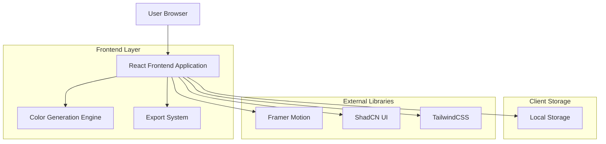
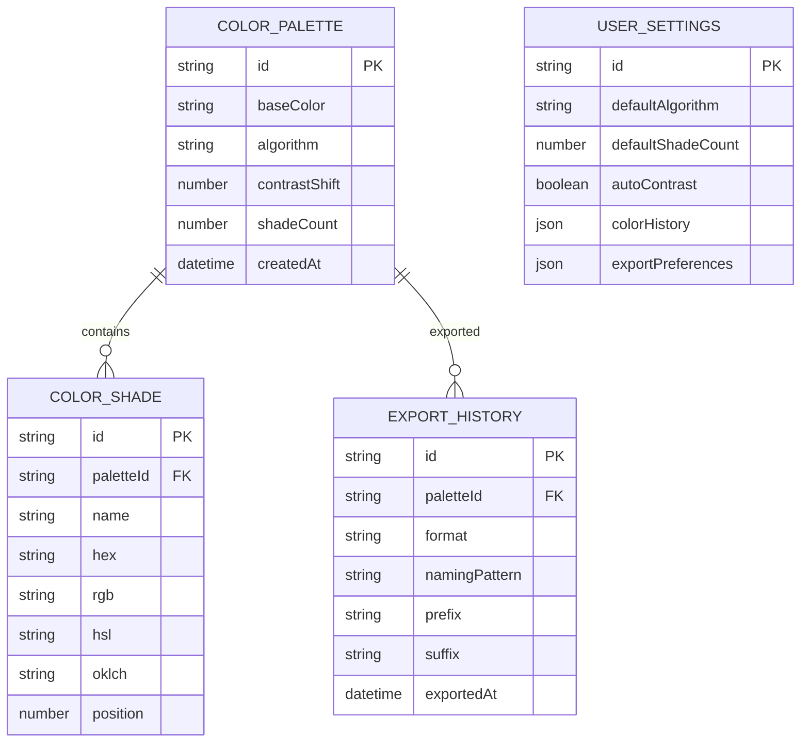

# Pigmenta - Arquitectura Técnica

## 1. Architecture design



## 2. Technology Description

- Frontend: React@18 + TypeScript@5 + Vite@5 + TailwindCSS@3 + ShadCN UI + Framer Motion@11
- State Management: Zustand@4
- Icons: Lucide React@0.400
- Color Processing: chroma-js@2.4
- File Export: file-saver@2.0
- Code Highlighting: prism-react-renderer@2.0

## 3. Route definitions

| Route | Purpose |
|-------|---------|
| / | Página principal con generador de colores y todas las funcionalidades |
| /export | Modal/panel de exportación integrado en la página principal |
| /settings | Panel de configuración avanzada (integrado como sidebar) |

## 4. API definitions

La aplicación no requiere APIs externas, toda la funcionalidad se maneja en el frontend:

### 4.1 Core Functions

**Generación de Paletas**
```typescript
interface ColorPalette {
  baseColor: string;
  algorithm: 'tailwind' | 'material' | 'custom';
  shades: ColorShade[];
  contrastShift: number;
}

interface ColorShade {
  name: string;
  hex: string;
  rgb: { r: number; g: number; b: number };
  hsl: { h: number; s: number; l: number };
  oklch: { l: number; c: number; h: number };
}
```

**Configuración de Exportación**
```typescript
interface ExportConfig {
  format: 'css' | 'tailwind' | 'json' | 'scss' | 'figma';
  namingPattern: '50-900' | 'alphabetic' | 'custom';
  prefix: string;
  suffix: string;
}
```

**Configuración de Aplicación**
```typescript
interface AppSettings {
  defaultAlgorithm: string;
  shadeCount: number;
  autoContrast: boolean;
  colorHistory: string[];
  exportPreferences: ExportConfig;
}
```

## 5. Server architecture diagram

No aplica - La aplicación es completamente frontend sin requerimientos de servidor.

## 6. Data model

### 6.1 Data model definition



### 6.2 Data Definition Language

La aplicación utiliza LocalStorage para persistencia de datos del cliente:

**Estructura de LocalStorage**
```typescript
// Configuración de usuario
interface UserSettings {
  defaultAlgorithm: 'tailwind' | 'material' | 'custom';
  defaultShadeCount: number; // 5-15
  autoContrast: boolean;
  colorHistory: string[]; // últimos 10 colores usados
  exportPreferences: {
    format: 'css' | 'tailwind' | 'json' | 'scss';
    namingPattern: '50-900' | 'alphabetic' | 'custom';
    prefix: string;
    suffix: string;
  };
}

// Paleta actual
interface CurrentPalette {
  id: string;
  baseColor: string;
  algorithm: string;
  contrastShift: number;
  shades: {
    name: string;
    hex: string;
    rgb: { r: number; g: number; b: number };
    hsl: { h: number; s: number; l: number };
    oklch: { l: number; c: number; h: number };
  }[];
  createdAt: string;
}

// Historial de exportaciones
interface ExportHistory {
  exports: {
    id: string;
    paletteId: string;
    format: string;
    timestamp: string;
    config: ExportConfig;
  }[];
}
```

**Inicialización de datos**
```typescript
// Configuración por defecto
const defaultSettings: UserSettings = {
  defaultAlgorithm: 'tailwind',
  defaultShadeCount: 11,
  autoContrast: true,
  colorHistory: ['#1E96BE', '#177B9D', '#0F5E78'],
  exportPreferences: {
    format: 'css',
    namingPattern: '50-900',
    prefix: '',
    suffix: ''
  }
};

// Paleta inicial con colores de Pigmenta
const initialPalette: CurrentPalette = {
  id: 'initial',
  baseColor: '#1E96BE',
  algorithm: 'tailwind',
  contrastShift: 0,
  shades: [
    { name: '50', hex: '#F0FAFE', rgb: {r: 240, g: 250, b: 254}, hsl: {h: 194, s: 71, l: 97}, oklch: {l: 0.97, c: 0.02, h: 194} },
    { name: '100', hex: '#E0F7FE', rgb: {r: 224, g: 247, b: 254}, hsl: {h: 194, s: 88, l: 94}, oklch: {l: 0.94, c: 0.04, h: 194} },
    { name: '200', hex: '#BAE9FD', rgb: {r: 186, g: 233, b: 253}, hsl: {h: 194, s: 91, l: 86}, oklch: {l: 0.86, c: 0.08, h: 194} },
    { name: '300', hex: '#7DD3FC', rgb: {r: 125, g: 211, b: 252}, hsl: {h: 194, s: 95, l: 74}, oklch: {l: 0.74, c: 0.12, h: 194} },
    { name: '400', hex: '#38BDF8', rgb: {r: 56, g: 189, b: 248}, hsl: {h: 194, s: 93, l: 60}, oklch: {l: 0.60, c: 0.16, h: 194} },
    { name: '500', hex: '#1E96BE', rgb: {r: 30, g: 150, b: 190}, hsl: {h: 194, s: 73, l: 43}, oklch: {l: 0.43, c: 0.14, h: 194} },
    { name: '600', hex: '#177B9D', rgb: {r: 23, g: 123, b: 157}, hsl: {h: 194, s: 74, l: 35}, oklch: {l: 0.35, c: 0.12, h: 194} },
    { name: '700', hex: '#0F5E78', rgb: {r: 15, g: 94, b: 120}, hsl: {h: 194, s: 78, l: 26}, oklch: {l: 0.26, c: 0.09, h: 194} },
    { name: '800', hex: '#074053', rgb: {r: 7, g: 64, b: 83}, hsl: {h: 194, s: 84, l: 18}, oklch: {l: 0.18, c: 0.06, h: 194} },
    { name: '900', hex: '#02222E', rgb: {r: 2, g: 34, b: 46}, hsl: {h: 194, s: 92, l: 9}, oklch: {l: 0.09, c: 0.03, h: 194} },
    { name: '950', hex: '#01131B', rgb: {r: 1, g: 19, b: 27}, hsl: {h: 194, s: 93, l: 5}, oklch: {l: 0.05, c: 0.02, h: 194} }
  ],
  createdAt: new Date().toISOString()
};
```