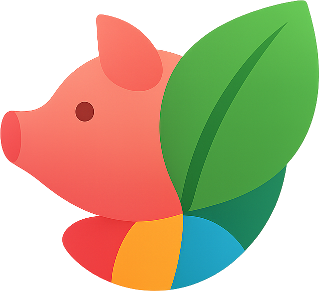

# 🐷🌿 Pigmenta

**Extractor de Paletas de Colores Inteligente para Game Developers**

Pigmenta es una herramienta web moderna y visual diseñada específicamente para desarrolladores de videojuegos, artistas y diseñadores que necesitan extraer paletas de colores precisas y profesionales de cualquier imagen.



## ✨ Características Principales

### 🔍 Eyedropper Avanzado
- **Lupa con zoom 20x** para selección pixel-perfect
- **Crosshair de precisión** con grid de píxeles
- **Información de color en tiempo real** (RGB, HEX)
- **Funciona en toda la modal** - no limitado solo a la imagen
- **Cursor personalizado** que reemplaza completamente el cursor normal

### 🎨 Generación de Paletas
- **Paletas monocromáticas** - Variaciones de un color seleccionado
- **Paletas multicolor** - Extracción automática de colores dominantes
- **Vista previa en tiempo real** de todas las paletas
- **Códigos de color precisos** para cada tono

### 📤 Sistema de Exportación
- **Múltiples formatos**: JSON, CSS, SCSS, Adobe ASE
- **Nombres personalizables** para cada paleta
- **Estructura optimizada** para workflows de desarrollo
- **Compatibilidad total** con herramientas de diseño

### 🎯 Experiencia de Usuario
- **Interfaz moderna y limpia** con animaciones fluidas
- **Drag & Drop** para carga de imágenes
- **Responsive design** - funciona en todos los dispositivos
- **Feedback visual inmediato** en todas las interacciones
- **Diseño optimizado** para desarrolladores de videojuegos

## 🚀 Demo en Vivo

**[🌐 Prueba Pigmenta](https://trae0rnqjre5-aperdelesi-6276-swon-projects-projects.vercel.app)**

## 🛠️ Stack Tecnológico

### Frontend
- **React 18+** - Componentes funcionales con hooks
- **TypeScript** - Tipado estricto y seguridad de tipos
- **Vite** - Build tool ultrarrápido
- **TailwindCSS** - Estilos utilitarios modernos
- **Framer Motion** - Animaciones fluidas y profesionales

### Librerías Especializadas
- **Lucide React** - Iconografía moderna y consistente
- **clsx** - Manejo condicional de clases CSS
- **Canvas API** - Manipulación avanzada de imágenes
- **File API** - Carga y procesamiento de archivos

### Herramientas de Desarrollo
- **ESLint** - Linting y calidad de código
- **Prettier** - Formateo automático
- **Vercel** - Deployment y hosting

## 📦 Instalación

### Prerrequisitos
- **Node.js** 18+ 
- **npm** o **pnpm**

### Pasos de Instalación

```bash
# Clonar el repositorio
git clone https://github.com/SwonDev/Pigmenta.git
cd Pigmenta

# Instalar dependencias
npm install
# o
pnpm install

# Iniciar servidor de desarrollo
npm run dev
# o
pnpm dev
```

La aplicación estará disponible en `http://localhost:5173`

## 🎮 Guía de Uso

### 1. Cargar Imagen
- **Arrastra y suelta** una imagen en la zona designada
- O **haz clic** para abrir el selector de archivos
- Formatos soportados: JPG, PNG, GIF, WebP

### 2. Usar el Eyedropper
- **Activa el modo eyedropper** haciendo clic en el botón correspondiente
- **Mueve el cursor** sobre la imagen para ver la lupa con zoom 20x
- **Haz clic** en cualquier píxel para seleccionar ese color
- **Observa** la información de color en tiempo real (RGB/HEX)

### 3. Generar Paletas
- **Paleta Monocromática**: Selecciona un color y genera variaciones automáticamente
- **Paleta Multicolor**: Extrae automáticamente los colores dominantes de la imagen
- **Vista previa** instantánea de todas las paletas generadas

### 4. Exportar Resultados
- **Personaliza el nombre** de tu paleta
- **Selecciona el formato** de exportación (JSON, CSS, SCSS, ASE)
- **Descarga** el archivo con tu paleta lista para usar

## 🏗️ Arquitectura del Proyecto

```
src/
├── components/          # Componentes reutilizables
│   ├── ui/             # Componentes base de UI
│   ├── Header.tsx      # Cabecera de la aplicación
│   ├── ImageImportModal.tsx  # Modal principal de importación
│   ├── MagnifierLens.tsx     # Lupa del eyedropper
│   └── PaletteExport.tsx     # Sistema de exportación
├── hooks/              # Hooks personalizados
├── utils/              # Funciones auxiliares
│   ├── colorExtraction.ts    # Algoritmos de extracción
│   ├── paletteGeneration.ts  # Generación de paletas
│   └── exportFormats.ts      # Formatos de exportación
├── types/              # Definiciones TypeScript
└── App.tsx            # Componente principal
```

## 🔧 Scripts Disponibles

```bash
# Desarrollo
npm run dev          # Servidor de desarrollo
npm run build        # Build de producción
npm run preview      # Preview del build

# Calidad de Código
npm run lint         # Ejecutar ESLint
npm run type-check   # Verificar tipos TypeScript
```

## 🌐 Deployment

### Vercel (Recomendado)

```bash
# Instalar Vercel CLI
npm i -g vercel

# Deploy
vercel
```

### Build Manual

```bash
# Generar build de producción
npm run build

# Los archivos estarán en /dist
```

## 🎯 Casos de Uso

### Para Game Developers
- **Extracción de paletas** de concept art y referencias
- **Creación de themes** consistentes para UI de juegos
- **Análisis de colores** de assets existentes
- **Generación de variaciones** para diferentes estados de juego

### Para Artistas y Diseñadores
- **Estudio de paletas** de referencias visuales
- **Creación de mood boards** con colores precisos
- **Exportación directa** a herramientas de diseño
- **Análisis cromático** detallado de imágenes

## 🤝 Contribuir

¡Las contribuciones son bienvenidas! Por favor:

1. **Fork** el repositorio
2. **Crea** una rama para tu feature (`git checkout -b feature/AmazingFeature`)
3. **Commit** tus cambios (`git commit -m 'Add some AmazingFeature'`)
4. **Push** a la rama (`git push origin feature/AmazingFeature`)
5. **Abre** un Pull Request

### Estándares de Código
- **TypeScript estricto** - Sin `any` types
- **Componentes funcionales** únicamente
- **Hooks** para lógica reutilizable
- **TailwindCSS** para todos los estilos
- **Nombres descriptivos** y consistentes

## 📄 Licencia

Este proyecto está bajo la Licencia MIT. Ver el archivo `LICENSE` para más detalles.

## 👨‍💻 Autor

**SwonDev** - [GitHub](https://github.com/SwonDev)

## 🙏 Agradecimientos

- **React Team** por el increíble framework
- **Vercel** por el hosting gratuito
- **TailwindCSS** por el sistema de diseño
- **Framer Motion** por las animaciones fluidas
- **Lucide** por los iconos modernos

---

**¿Te gusta Pigmenta?** ⭐ ¡Dale una estrella al repositorio!

**¿Encontraste un bug?** 🐛 [Reporta un issue](https://github.com/SwonDev/Pigmenta/issues)

**¿Tienes una idea?** 💡 [Sugiere una feature](https://github.com/SwonDev/Pigmenta/issues)